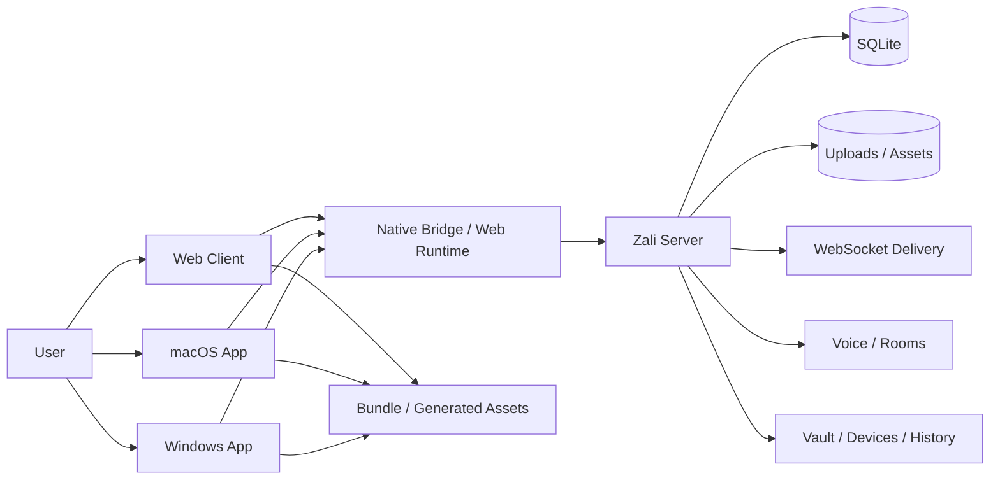
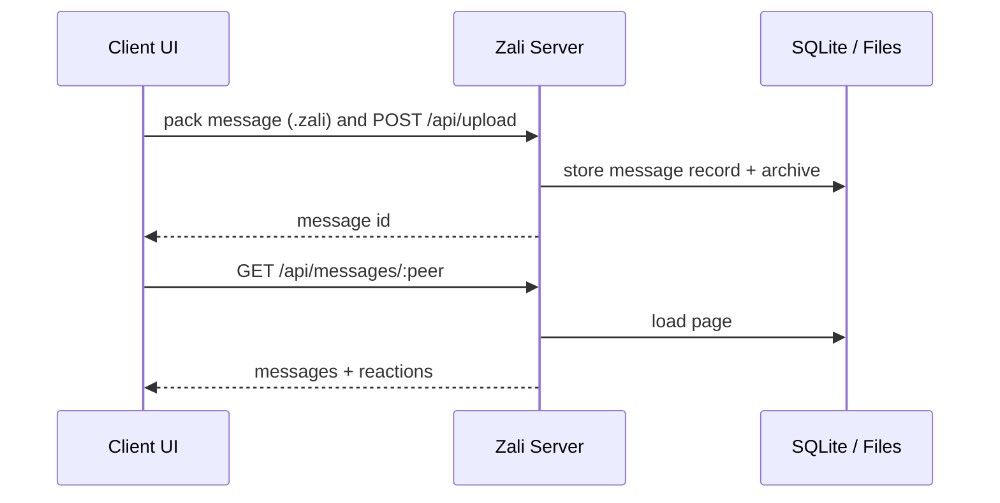

# ZaliMessenger Design & Code Document

> Документ отражает архитектуру ZaliMessenger по текущему коду и проектным материалам.
> В этом checkout сейчас лежит только серверный исходник в корне репозитория, но сам продукт
> по дизайну и runtime-сурфейсам остается кроссплатформенным: Web, macOS, Windows и shared Rust core.

## 1. Что такое ZaliMessenger

ZaliMessenger - это кроссплатформенный мессенджер с серверной синхронизацией, облачными чатами,
голосовыми звонками и собственным контейнером передачи данных `.zali`.

Ключевая идея продукта:

- единый аккаунт и единый серверный backend;
- одинаковая логика упаковки/распаковки сообщений на всех платформах;
- Web UI как базовый интерфейс, а macOS и Windows как native shells поверх общего web-слоя;
- облачная синхронизация состояния и ключей включается как пользовательская настройка;
- визуальный стиль - dark glass + lime accent.

## 2. Дизайн-ядро

Проект опирается на визуальную систему Zali:

- основной фон: очень темный, почти черный;
- акцент: lime / neon-green;
- поверхности: glassmorphism с мягким blur, прозрачностью и тонкой рамкой;
- типографика: крупные жирные заголовки, спокойный body, моноширинный шрифт для путей и хэшей;
- тон: технический, короткий, уверенный;
- плотность интерфейса: высокая, но без визуального шума.

Практически это выражается в следующих принципах:

- кнопки - плоские, хорошо читаемые, с ярким акцентом;
- карточки - с малым радиусом, тонкой рамкой и глубиной;
- формы - компактные, без лишних украшений;
- пустые состояния - объясняют, что делать дальше, а не оставляют молчание;
- состояния ошибок - показываются явно и коротко.

## 3. Архитектура высокого уровня



Слои продукта:

1. Presentation layer - Web UI и native shell.
2. Bridge layer - typed native messages и bus-events.
3. Transport layer - HTTP, WebSocket, upload/download.
4. Backend layer - auth, messaging, servers, voice, vault, devices.
5. Storage layer - SQLite, uploads, assets, keyring, local state.

## 4. Текущее состояние репозитория

В этом checkout на данный момент лежит серверный исходник в root-layout:

- `src/main.rs`
- `Cargo.toml`
- `Cargo.lock`

Исторически проект также включает следующие surfaces:

- `web/` - браузерный UI и WKWebView-бандл;
- `apps/macos/` - SwiftUI приложение;
- `apps/windows/` - Rust desktop shell;
- `core/` - shared Rust core;
- `sdk/` - низкоуровневый SDK для `.zali`;
- `Server/` - старое дерево runtime-артефактов, логов и базы в текущем checkout.

## 5. Серверный runtime

Основной backend реализован на Rust + Axum + SQLite.

### 5.1 Конфигурация

Сервер читает окружение:

- `JWT_SECRET` - секрет для JWT;
- `ALLOWED_ORIGINS` - CORS origins;
- `MAX_UPLOAD_BYTES` - лимит загрузок;
- `ALLOW_GUEST_MODE` - гостевой режим;
- `AUTH_COOKIE_SECURE` - secure-cookie режим;
- `RATE_LIMIT_WINDOW_SECS` - окно rate-limit;
- `RATE_LIMIT_MAX_ATTEMPTS` - максимум попыток;
- `WS_CHANNEL_CAPACITY` - емкость WS-канала;
- `BIND_ADDR` - адрес прослушивания.

### 5.2 Runtime state

Серверное состояние в `AppState`:

- `db` - SQLite pool;
- `data_dir` - каталог данных;
- `uploads_dir` - каталог uploads;
- `user_connections` - активные WS соединения по пользователю;
- `voice_rooms` - in-memory голосовые комнаты;
- `user_voice_rooms` - индекс пользователь -> комната;
- `ws_tickets` - одноразовые краткоживущие WS ticket'ы;
- `login_attempts` - rate-limit по логинам;
- `config` - конфиг из окружения.

### 5.3 Auth extractor

`AuthenticatedUser` принимает несколько путей аутентификации:

- `Authorization: Bearer <JWT>`;
- HttpOnly cookie `zali_auth`;
- query token для legacy сценариев;
- `ticket` query параметр для короткоживущего WS ticket.

Guest fallback разрешается только если включен `ALLOW_GUEST_MODE`.

## 6. Модель данных

### 6.1 Основные сущности

| Сущность | Назначение |
| --- | --- |
| `users` | аккаунты, парольный хэш, token version, флаг cloud vault sync |
| `messages` | личные и серверные сообщения |
| `contacts` | список контактов владельца |
| `avatars` | аватары пользователей |
| `conversation_keys` | ключи переписки / версионность ключей |
| `account_devices` | устройства аккаунта, approval/revocation, epoch |
| `account_vault_events` | облачные vault-ивенты |
| `history_tickets` | временные билеты на экспорт / историю |
| `transparency_log` | аудит device/vault событий |
| `servers` | серверы / сообщества |
| `server_members` | участники серверов и их роли |
| `server_roles` | роли и права |
| `channels` | каналы внутри серверов |
| `channel_permissions` | права на канал по роли |
| `server_invites` | инвайты на серверы |
| `reactions` | реакции на сообщения |

### 6.2 Временные и in-memory структуры

| Сущность | Назначение |
| --- | --- |
| `voice_rooms` | активные голосовые комнаты в памяти |
| `user_voice_rooms` | быстрый индекс пользователя в комнате |
| `ws_tickets` | одноразовые WS-ticket'и для браузерного voice socket |
| `login_attempts` | rate-limit на попытки входа |

### 6.3 Индексация и хранение

Сервер использует индексы на:

- сообщения по receiver / sender / timestamp;
- server messages по `(server_id, channel_id, timestamp)`;
- contacts по owner;
- members / roles / invites;
- reactions по `message_id` и `reactor`;
- device/vault/history tables по owner, device, epoch и expires_at.

## 7. API surface

### 7.1 Auth

| Method | Path | Назначение |
| --- | --- | --- |
| POST | `/api/auth/register` | регистрация |
| POST | `/api/auth/login` | вход |
| POST | `/api/auth/ws-ticket` | короткоживущий ticket для voice WS |
| POST | `/api/auth/logout` | выход |
| GET/PATCH | `/api/auth/me` | информация о сессии и настройка cloud vault sync |

### 7.2 Users / profile

| Method | Path | Назначение |
| --- | --- | --- |
| GET | `/api/users` | поиск пользователей |
| GET | `/api/avatar/:username` | получение аватара |
| POST/DELETE | `/api/avatar` | загрузка / удаление своего аватара |

### 7.3 Contacts

| Method | Path | Назначение |
| --- | --- | --- |
| GET | `/api/contacts` | список контактов |
| POST | `/api/contacts` | добавить контакт |
| DELETE | `/api/contacts/:username` | удалить контакт |

### 7.4 Servers

| Method | Path | Назначение |
| --- | --- | --- |
| GET/POST | `/api/servers` | список серверов / создание |
| GET | `/api/discover/servers` | публичный discovery |
| POST | `/api/servers/join` | join по ссылке |
| GET/POST | `/api/servers/:server_id/channels` | каналы |
| PATCH/DELETE | `/api/servers/:server_id/channels/:channel_id` | update / delete channel |
| PUT | `/api/servers/:server_id` | update server |
| GET/PUT/DELETE | `/api/servers/:server_id/assets/avatar` | avatar asset |
| GET/PUT/DELETE | `/api/servers/:server_id/assets/banner` | banner asset |
| GET/POST | `/api/servers/:server_id/members` | members |
| PATCH/DELETE | `/api/servers/:server_id/members/:username` | update / remove member |
| GET/POST | `/api/servers/:server_id/roles` | roles |
| PATCH/DELETE | `/api/servers/:server_id/roles/:role_id` | update / delete role |
| GET/POST | `/api/servers/:server_id/invites` | invites |
| POST | `/api/invites/:code/join` | join invite |
| GET/PUT | `/api/servers/:server_id/channels/:channel_id/permissions` | channel permissions |

### 7.5 Messages and files

| Method | Path | Назначение |
| --- | --- | --- |
| GET | `/api/messages/:user` | история личных сообщений |
| POST | `/api/message/:id/reaction` | реакция |
| POST | `/api/upload` | upload `.zali` message payload |
| GET | `/api/download/:id` | download message archive |
| DELETE | `/api/message/:id` | delete message |
| GET | `/uploads/:filename` | прямой download файла |

### 7.6 Voice / device / vault

| Method | Path | Назначение |
| --- | --- | --- |
| GET | `/ws` | voice / message websocket |
| GET | `/health` | healthcheck |
| GET/POST | `/api/devices` | list devices / register device |
| POST | `/api/devices/approve` | approve device |
| DELETE | `/api/devices/:device_id` | revoke device |
| GET/POST | `/api/vault/events` | cloud vault events |
| GET/POST | `/api/history-tickets` | history export tickets |
| GET | `/api/transparency-log` | audit log |

## 8. Message format and SDK

Каждое сообщение передается как `.zali` архив.

Характеристики формата:

- магический заголовок `ZALIMSSG`;
- AES-256-GCM для содержимого;
- единый SDK для упаковки и распаковки;
- одинаковая логика на клиентах через shared Rust core / SDK;
- вложения сохраняются отдельно и связаны с сообщением метаданными.

Поток:

1. клиент собирает payload;
2. SDK упаковывает текст и вложения;
3. сервер сохраняет `.zali`-файл и метаданные;
4. получатель скачивает архив;
5. клиент распаковывает и расшифровывает его тем же SDK.

## 9. Authentication and session design

### 9.1 Session model

Сессия опирается на JWT, который может передаваться:

- в Authorization header;
- в cookie;
- в отдельных legacy query-путях.

В ответе auth server возвращает:

- `token`;
- `username`;
- `cloudVaultSyncEnabled`.

### 9.2 Token invalidation

Сервер использует `token_version` в таблице `users`.

Это позволяет:

- инвалидировать токены на logout;
- ограничивать stale sessions;
- привязывать JWT к актуальному состоянию пользователя.

### 9.3 Cloud vault sync flag

`cloudVaultSyncEnabled` - флаг аккаунта, а не только локальная настройка устройства.

Смысл:

- включено - клиент может публиковать / подгружать cloud vault state;
- выключено - облачная синхронизация ключей не используется;
- сервер может сразу очищать связанные cloud vault данные при выключении.

## 10. Device / vault / history model

Эта подсистема отвечает за более тяжелые и чувствительные сценарии:

- устройства аккаунта;
- облачные vault events;
- history tickets;
- transparency log.

### 10.1 Device lifecycle

Основной жизненный цикл:

1. устройство регистрируется;
2. сервер сохраняет его public material и ключ-пакет;
3. устройство может быть approved / revoked;
4. approval влияет на доступ к vault/history surfaces.

### 10.2 Vault events

`account_vault_events` хранит зашифрованные vault events, где:

- есть владелец;
- есть устройство-источник;
- есть optional target device;
- есть vault epoch;
- есть encrypted payload;
- есть signature.

### 10.3 History tickets

`history_tickets` используются как временные билеты на экспорт / доступ к истории.

Поля:

- `issued_by_device_id`;
- `issued_to_device_id`;
- `conversation_id`;
- `from_time`, `to_time`;
- `expires_at`;
- `encrypted_export_secrets`;
- `signature`.

### 10.4 Transparency log

`transparency_log` нужен для аудита device/vault событий и помогает восстановить цепочку действий.

## 11. Messaging flows

### 11.1 Personal messages



### 11.2 Reactions

Реакции хранятся отдельно в `reactions` и агрегируются в response.

Поведение:

- один reactor может обновлять свою реакцию;
- сервер возвращает сводку по emojis;
- клиент хранит `myReaction`.

### 11.3 Attachments

Вложения упаковываются внутрь `.zali` или сопутствующего upload payload и доставляются через:

- `/api/upload`
- `/api/download/:id`
- `/uploads/:filename`

## 12. Servers / channels / roles

### 12.1 Community model

Комьюнити строится из:

- серверов;
- каналов;
- участников;
- ролей;
- приглашений;
- пермишенов на каналы.

### 12.2 Roles and permissions

Роли включают права вроде:

- view / send;
- manage channels / roles;
- invite;
- attach / embed;
- react / pin / mention;
- voice;
- kick / ban.

### 12.3 Server ownership

На пользователя действует лимит на число серверов:

- сервер создается только если не превышен `MAX_SERVERS_PER_USER`;
- в текущей реализации лимит установлен на 25.

### 12.4 Public discovery

Публичные серверы доступны через `/api/discover/servers`.

Это позволяет UI показывать:

- список открытых сообществ;
- join-link;
- метаданные и каналы.

## 13. Voice architecture

### 13.1 Voice transport

У проекта есть два режима voice:

1. browser / WebView voice socket;
2. native voice transport для desktop shell.

### 13.2 WS ticket flow

Для браузерного voice socket используется короткоживущий `ws-ticket`:

1. клиент запрашивает `/api/auth/ws-ticket`;
2. сервер выдает одноразовый ticket с коротким TTL;
3. клиент подключает WS как `...?ticket=...`;
4. сервер валидирует ticket и привязывает соединение к username;
5. тикет очищается по TTL или после использования.

### 13.3 Keepalive and reconnect

Voice socket использует:

- heartbeat `ping` / `pong`;
- reconnect backoff;
- reset generation при закрытии сокета;
- retry при ошибке ticket fetch.

### 13.4 Call lifecycle

Основные состояния:

- `ringing`;
- `active`;
- `missed`;
- `rejected`;
- `cancelled`;
- `ended`.

Типовой DM flow:

1. `voice_call_invite`;
2. `voice_call_outgoing` / `voice_call_incoming`;
3. `voice_call_accept` или `voice_call_reject`;
4. `voice_call_connected` / `voice_call_missed`;
5. завершение через `voice_call_end`.

### 13.5 Room model

В памяти сервер держит `VoiceRoom`:

- `room_type`: `dm` или `channel`;
- `server_id` / `channel_id`;
- `call_state`;
- `initiator` / `target`;
- `participants`.

## 14. Native bridge design

Native bridge - один из ключевых архитектурных элементов продукта.

### 14.1 Typed protocol

В проекте используется `bridge_protocol.json` как общий источник типа сообщений.

Из него генерируются / синхронизируются:

- JS native message types;
- Swift enum / helpers;
- Windows typed IPC surface;
- bridge validation logic.

### 14.2 Native message families

Ключевые команды bridge:

- auth/session;
- contacts;
- messages / caching;
- avatars;
- server/network config;
- voice;
- style persistence;
- key/session sync.

### 14.3 Bridge goals

Цели bridge:

- исключить хрупкие строковые dispatch-цепочки;
- держать JS / Swift / Rust в одном контракте;
- ловить несовместимость на сборке, а не в проде;
- обеспечить одинаковую native behavior на macOS и Windows.

### 14.4 Message dispatch concept

Целевое правило:

1. новый тип добавляется в `bridge_protocol.json`;
2. генератор обновляет typed enums / helpers;
3. платформа обязана явно обработать новый кейс;
4. если кейс не обработан, сборка должна подсветить проблему.

## 15. Web UI design

### 15.1 Layout

Главные области интерфейса:

- sidebar с диалогами / серверами;
- header / status area;
- main chat view;
- message composer;
- auth / settings surface;
- device / vault tooling как вспомогательный advanced layer.

### 15.2 Interaction model

Основные UX-паттерны:

- быстрый поиск пользователей;
- автоподсказки контактов;
- empty states вместо пустых панелей;
- явные error hints при сетевых проблемах;
- optimistic UI там, где это безопасно;
- requestAnimationFrame для coalesced message rendering.

### 15.3 Design system

Ключевые визуальные элементы:

- glass cards;
- lime accent buttons;
- compact panels;
- muted secondary text;
- status badges;
- dense but readable lists.

## 16. Local storage / persistence

### 16.1 Web storage

Web UI использует local/session storage для:

- последней сессии;
- состояния vault unlock;
- cloud sync flag;
- cached conversation keys;
- pending outbox;
- message cache;
- style preferences.

### 16.2 Native desktop storage

Windows и macOS хранят локальное состояние в своих platform-specific местах:

- session token;
- current device id;
- message cache;
- style / config;
- voice config / socket state.

### 16.3 Server file system

Сервер хранит:

- uploads;
- avatars / server assets;
- SQLite database;
- логические asset directories.

## 17. Error handling and resilience

### 17.1 Principles

- network errors не должны silently reset'ить состояние;
- stale caches не должны ломать вход;
- unavailable advanced features не должны блокировать обычный chat flow;
- reconnect and retry должны быть bounded;
- user-visible state должен объяснять, что произошло.

### 17.2 Server-side resilience

В backend используются:

- rate limiting;
- one-time tickets;
- cleanup jobs;
- index-backed SQLite queries;
- backpressure-aware WS sending.

### 17.3 Client-side resilience

В UI:

- render coalescing;
- reconnect backoff;
- typed bridge validation;
- fallback-only behavior for optional subsystems.

## 18. Deployment notes

### 18.1 Run server locally

```bash
cargo run
```

### 18.2 Common environment setup

```bash
export JWT_SECRET="a-very-long-secret-value-at-least-32-chars"
export BIND_ADDR="0.0.0.0:3000"
export ALLOWED_ORIGINS="https://msgs.zalikus.org,http://localhost:3000"
```

### 18.3 Build / validate

```bash
python3 bundle_web.py
cargo check
swift build --package-path macOS
cargo run --manifest-path apps/windows/Cargo.toml
```

## 19. What to keep in mind during further development

1. Backend and bridge should stay typed-first.
2. UI should never depend on a hidden trust ritual for ordinary chat operations.
3. Device/vault features should remain separate from the happy path.
4. New API surface should be versioned when the contract becomes unstable.
5. Generated assets should be treated as build outputs, not as the primary source of truth.

## 20. Source map

Useful source anchors for the current checkout:

- `server/src/main.rs` - main server application, DB schema, routes, WS, device/vault/history logic.
- `Cargo.toml` - server dependencies and build profile.
- `README.md` - old top-level project overview.
- `DEVELOPMENT.md` - project map and build commands.
- `Zali_BrandBook.md` - visual identity and UI language.

---

Если нужен следующий шаг, лучше всего разрезать этот документ на три отдельных файла:

1. architecture.md
2. api.md
3. ui-and-brand.md

Так их будет проще поддерживать, чем держать все в одном монолите.
